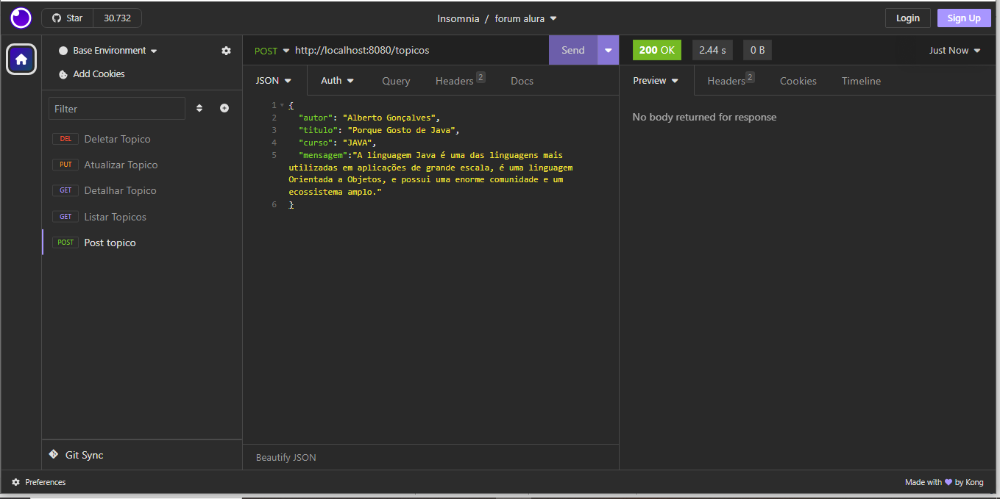
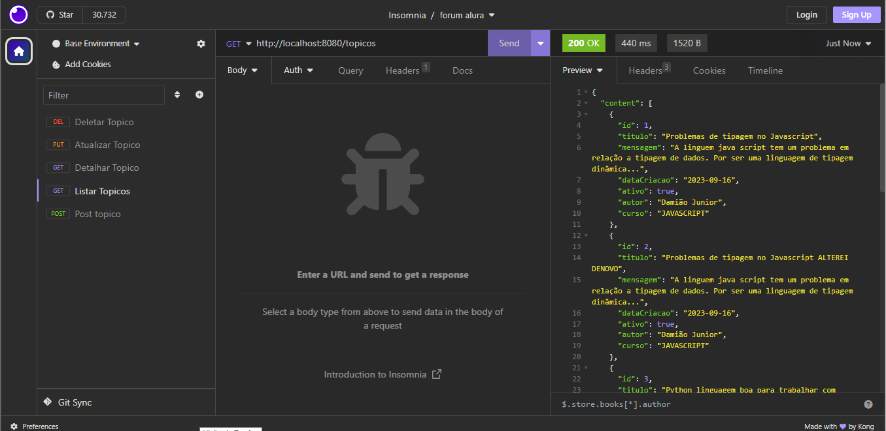
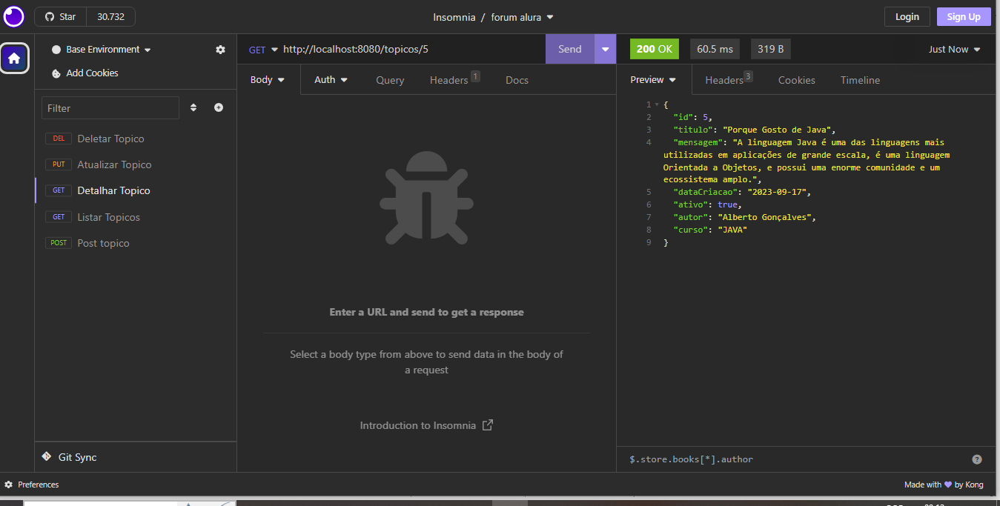
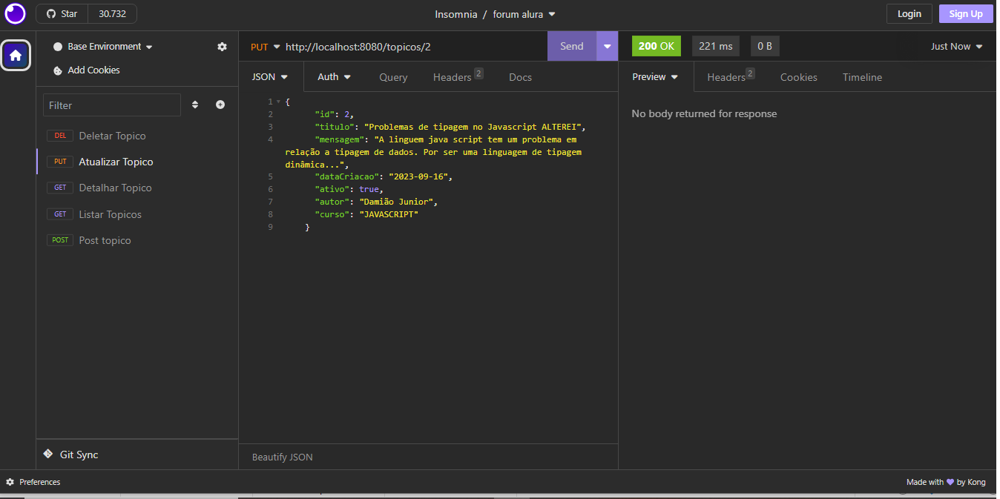
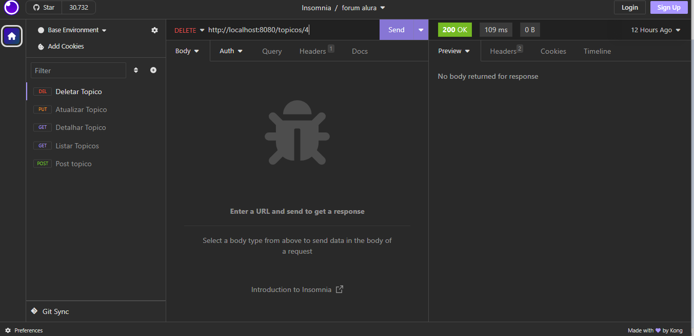

<h1>API Forum Alura</h1>

Esta é a API do forum alura, trata-se de uma API REST que recebe os tópicos vindos do Front End, assim como devolve informações requisitadas e faz alterações e exclusões em tópicos cadastrados.

<h2>Tecnologias utilizadas</h2>
<ul>
  <li>Java</li>
  <li>MySql</li>
  <li>Spring Boot</li>
  <li>Jpa + Hibernate</li>
  <li>Maven</li>
  <li>Insomnia</li>
</ul>

<h2>Telas de Testes Com Insomnia</h2>
<h3>Inclusão de Tópico no Forum</h3>

Nesta tela o Front End envia, através de uma requisição POST do protocolo HTTP, um JSON contendo os dados do tópico, tais como: nome do autor, título, mensagem e o curso. Ao receber o JSON com estas informações, a API valida, conforme as regras de negócio, e em seguida persiste as informações na base de dados.

<h3>Listagem de Tópicos</h3>

Nesta tela, ao receber uma requisição do tipo GET, a aPI devolve um JSON contendo os dados dos tópicos registrados.

<h3>Detalhamento de Tópico</h3>

Nesta tela, ao receber uma requisição do tipo GET na rota topicos/id (onde a variável id corresponde a um ID de um tópico na base de dados), a API devolve um JSON contndo apenas o tópico solicitado na variável id. 

<h3>Atualização de Tópico</h3>

Nesta tela, ao receber uma requisição do tipo PUT contendo em seu corpo um JSON com informações a serem atualizadas, a API faz as devidas velidações e em seguida faz um UPDATE no registro do tópico referente ao ID passado na requisição.

<h3>Exclusão de Tópico</h3>

Nesta tela, ao receber uma requisição do tipo DELETE, a API exclui o registro do tópico correspondente ao ID enviado na requisição.

<h2>Conclusão</h2>

A finalidade deste projeto foi de aprimorar os conhecimentos adquiridos nas aulas de Spring Boot na curso de formação Oracle One Next Education. Neste projeto foi explorado as funcionalidades do framework Spring Boot, aplicações de DTO (Data Transfer Objects), padrão de API REST e Hibernate + JPA. 

